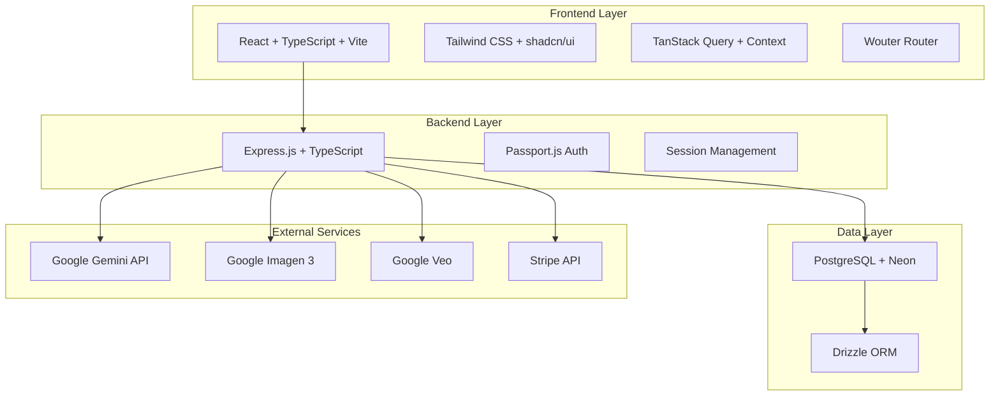
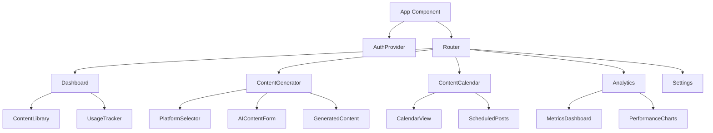
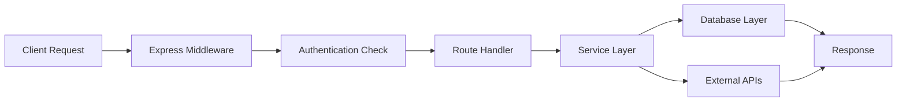

# Design Document

## Overview

ContentMagic is architected as a modern full-stack web application with a React TypeScript frontend and Node.js Express backend. The system integrates with Google's AI services for content generation and uses PostgreSQL for data persistence. The architecture emphasizes mobile-first design, type safety, and scalable AI integration patterns.

## Architecture

### System Architecture Diagram



### Technology Stack

**Frontend:**
- React 18 with TypeScript for type safety and modern React patterns
- Vite for fast development and optimized builds
- Tailwind CSS with custom design system using CSS variables
- shadcn/ui components built on Radix UI for accessibility
- Wouter for lightweight client-side routing
- TanStack Query for server state management and caching
- React Context for authentication state

**Backend:**
- Node.js with Express.js framework
- TypeScript with ES modules for consistency with frontend
- Passport.js with local strategy for authentication
- Express sessions with secure cookie configuration
- Structured logging and error handling middleware

**Database:**
- PostgreSQL hosted on Neon for serverless scaling
- Drizzle ORM for type-safe database operations
- Drizzle Kit for schema migrations

## Components and Interfaces

### Frontend Component Architecture



### Key Frontend Components

**AuthProvider Component:**
- Manages authentication state using React Context
- Handles login/logout operations
- Provides user session data to child components
- Integrates with TanStack Query for user data fetching

**ContentGenerator Component:**
- Platform selection interface (Instagram, TikTok, etc.)
- AI content generation forms with real-time validation
- Preview of generated content before saving
- Usage limit display and upgrade prompts

**ContentCalendar Component:**
- Calendar grid view with drag-and-drop scheduling
- Content preview modals
- Batch scheduling operations
- Platform-specific content filtering

**Analytics Dashboard:**
- Metric visualization using chart libraries
- Date range filtering
- Platform performance comparison
- Export functionality for reports

### Backend API Architecture



### API Endpoints Design

**Authentication Routes:**
- `POST /api/auth/register` - User registration
- `POST /api/auth/login` - User login
- `POST /api/auth/logout` - User logout
- `GET /api/auth/me` - Get current user

**Content Generation Routes:**
- `POST /api/content/generate-caption` - Generate AI caption
- `POST /api/content/generate-image` - Generate AI image
- `POST /api/content/generate-video` - Generate AI video
- `GET /api/content/library` - Get user's content library
- `DELETE /api/content/:id` - Delete content item

**Scheduling Routes:**
- `POST /api/schedule` - Schedule content
- `GET /api/schedule` - Get scheduled content
- `PUT /api/schedule/:id` - Update scheduled content
- `DELETE /api/schedule/:id` - Remove from schedule

**Analytics Routes:**
- `GET /api/analytics/overview` - Get analytics overview
- `GET /api/analytics/performance` - Get performance metrics
- `GET /api/analytics/trends` - Get trend data

**Subscription Routes:**
- `GET /api/subscription/status` - Get subscription status
- `POST /api/subscription/upgrade` - Upgrade subscription
- `GET /api/subscription/usage` - Get usage statistics

## Data Models

### Database Schema

```sql
-- Users table
CREATE TABLE users (
    id SERIAL PRIMARY KEY,
    email VARCHAR(255) UNIQUE NOT NULL,
    password_hash VARCHAR(255) NOT NULL,
    subscription_tier VARCHAR(50) DEFAULT 'free',
    monthly_usage INTEGER DEFAULT 0,
    usage_reset_date TIMESTAMP DEFAULT CURRENT_TIMESTAMP,
    created_at TIMESTAMP DEFAULT CURRENT_TIMESTAMP,
    updated_at TIMESTAMP DEFAULT CURRENT_TIMESTAMP
);

-- Posts table
CREATE TABLE posts (
    id SERIAL PRIMARY KEY,
    user_id INTEGER REFERENCES users(id) ON DELETE CASCADE,
    platform VARCHAR(50) NOT NULL,
    content_type VARCHAR(50) NOT NULL, -- 'caption', 'image', 'video'
    content_data JSONB NOT NULL, -- stores generated content
    metadata JSONB, -- platform-specific metadata
    scheduled_at TIMESTAMP,
    created_at TIMESTAMP DEFAULT CURRENT_TIMESTAMP
);

-- Analytics table
CREATE TABLE analytics (
    id SERIAL PRIMARY KEY,
    post_id INTEGER REFERENCES posts(id) ON DELETE CASCADE,
    metric_type VARCHAR(50) NOT NULL, -- 'views', 'likes', 'shares', etc.
    metric_value INTEGER NOT NULL,
    recorded_at TIMESTAMP DEFAULT CURRENT_TIMESTAMP
);

-- Subscriptions table
CREATE TABLE subscriptions (
    id SERIAL PRIMARY KEY,
    user_id INTEGER REFERENCES users(id) ON DELETE CASCADE,
    stripe_subscription_id VARCHAR(255),
    status VARCHAR(50) NOT NULL,
    current_period_start TIMESTAMP,
    current_period_end TIMESTAMP,
    created_at TIMESTAMP DEFAULT CURRENT_TIMESTAMP
);
```

### TypeScript Interfaces

```typescript
// User interfaces
interface User {
  id: number;
  email: string;
  subscriptionTier: 'free' | 'pro' | 'creator';
  monthlyUsage: number;
  usageResetDate: Date;
}

// Content interfaces
interface GeneratedContent {
  id: number;
  userId: number;
  platform: Platform;
  contentType: 'caption' | 'image' | 'video';
  contentData: {
    text?: string;
    imageUrl?: string;
    videoUrl?: string;
    hashtags?: string[];
  };
  metadata: Record<string, any>;
  scheduledAt?: Date;
  createdAt: Date;
}

// Platform types
type Platform = 'instagram' | 'tiktok' | 'youtube' | 'linkedin' | 'twitter';

// Analytics interfaces
interface AnalyticsMetric {
  id: number;
  postId: number;
  metricType: string;
  metricValue: number;
  recordedAt: Date;
}
```

## Error Handling

### Frontend Error Handling

**TanStack Query Error Boundaries:**
- Global error boundary for unhandled React errors
- Query-specific error states with retry mechanisms
- User-friendly error messages for API failures
- Offline state detection and handling

**Form Validation:**
- Real-time validation using React Hook Form and Zod
- Server-side validation error display
- Input sanitization for AI prompts

### Backend Error Handling

**Structured Error Response:**
```typescript
interface ApiError {
  success: false;
  error: {
    code: string;
    message: string;
    details?: any;
  };
  timestamp: string;
}
```

**Error Categories:**
- Authentication errors (401, 403)
- Validation errors (400)
- Rate limiting errors (429)
- AI service errors (502, 503)
- Database errors (500)

**Logging Strategy:**
- Structured JSON logging with Winston
- Error tracking with stack traces
- Performance monitoring for AI API calls
- User action audit trails

## Testing Strategy

### Frontend Testing

**Unit Testing:**
- Jest and React Testing Library for component testing
- Mock API responses using MSW (Mock Service Worker)
- Custom hook testing with React Hooks Testing Library
- Accessibility testing with jest-axe

**Integration Testing:**
- End-to-end user flows with Playwright
- Cross-browser compatibility testing
- Mobile responsiveness testing
- Performance testing with Lighthouse CI

### Backend Testing

**API Testing:**
- Supertest for HTTP endpoint testing
- Database integration tests with test database
- Mock external API calls (Google AI services, Stripe)
- Authentication flow testing

**Load Testing:**
- AI API rate limiting validation
- Database connection pool testing
- Concurrent user simulation
- Memory leak detection

### AI Integration Testing

**Content Generation Testing:**
- Mock AI responses for consistent testing
- Content safety filter validation
- Platform-specific format testing
- Error handling for AI service failures

**Usage Tracking Testing:**
- Subscription limit enforcement
- Usage counter accuracy
- Billing cycle reset validation
- Upgrade flow testing

### Security Testing

**Authentication Security:**
- Password hashing validation
- Session management security
- CSRF protection testing
- Rate limiting validation

**Data Protection:**
- SQL injection prevention
- XSS protection validation
- API input sanitization
- User data isolation testing